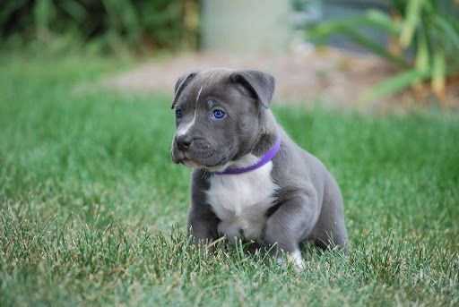

# Ohi Longe

My name is Ohi Longe. I am Computer Science major at Northwest Missouri State University in my Senior Year. I hope to become a Machine Learning engineer and more in the near future. I have several hobbies such as gaming, watchin/playing soccer and going to lovely restuarants. My favorite video game is The Last Of Us series, I'd be lying if I said it wasn't. It might not seem like much information but it is to me. 

I also like travelling and going to different states in the United States or outside of the country. One of my favorite places I've visited is Dubai because of their exotic lifestyle. I am also proud to be Nigerian and especially proud of Nigerian artistes and their massive influence to music in Africa and worldwide. 



[Link for pitbull puppies](https://www.finestpitbullsmade.com/how-much-are-pitbull-puppies/)

---

## Table for Food/Drinks

Below is a table that includes food and drinks that are very handy and nutritious when visiting the beach especially on a very sunny with the family and kids. 

| Food | Location | Price |
| --- | --- | ---: |
| Chips | Walmart | $3 |
| Sandwich | Hyvee | $2 |
| Sandtoys | Walmart | $3 |
| umbrella | Hyvee | $10 |

---

### Favorite quotes

> If you are not willing to learn, no one can help you. If you are determined to learn, no one can stop you. 

*Zig Ziglar*

> The biggest adventure you can take is to live the life of your dreams.

*Oprah Winfrey*

---

### Geometry Elementary/Polygon

> the part of Euclidean geometry dealing with the simpler properties of straight lines, circles, planes, polyhedrons, the sphere, the cylinder, and the right circular cone
[link source](https://www.merriam-webster.com/dictionary/elementary%20geometry)

```
struct point2d {
    ftype x, y;
    point2d() {}
    point2d(ftype x, ftype y): x(x), y(y) {}
    point2d& operator+=(const point2d &t) {
        x += t.x;
        y += t.y;
        return *this;
    }
    point2d& operator-=(const point2d &t) {
        x -= t.x;
        y -= t.y;
        return *this;
    }
    point2d& operator*=(ftype t) {
        x *= t;
        y *= t;
        return *this;
    }
    point2d& operator/=(ftype t) {
        x /= t;
        y /= t;
        return *this;
    }
    point2d operator+(const point2d &t) const {
        return point2d(*this) += t;
    }
    point2d operator-(const point2d &t) const {
        return point2d(*this) -= t;
    }
    point2d operator*(ftype t) const {
        return point2d(*this) *= t;
    }
    point2d operator/(ftype t) const {
        return point2d(*this) /= t;
    }
};
point2d operator*(ftype a, point2d b) {
    return b * a;
}
```
[Code Source](https://cp-algorithms.com/geometry/basic-geometry.html)


